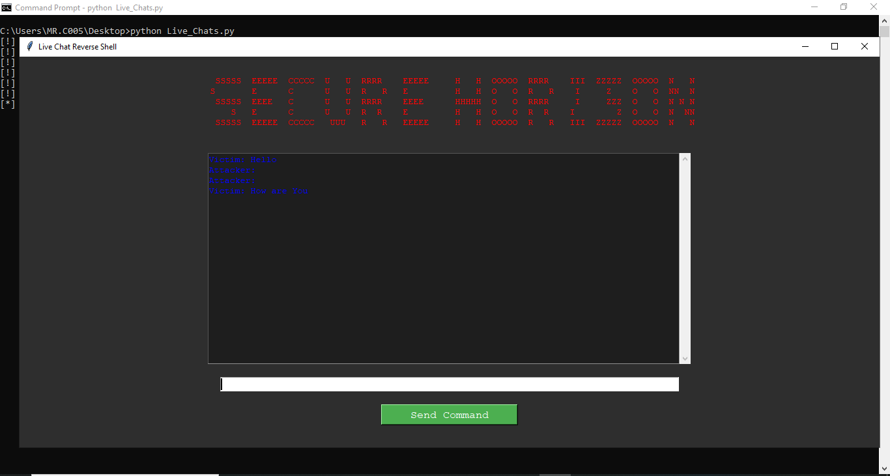

<h1 align="center">Hi 👋, I'm Secure Horizon [ M.R.C005 ]</h1>
<h3 align="center">A passionate frontend developer from Srilanka</h3>

<p align="center">  </p>

<p align="center"> <a href="https://github.com/ryo-ma/github-profile-trophy"></a> </p>

### Secure Horizon
# Live Chat Reverse Shell



Live Chat Reverse Shell යනු Python භාවිතයෙන් සාදන ලද සරල චැට් සහ රිවර්ස් ශෙල් ක්‍රමයක් වන අතර, Windows සහ Android පද්ධති මත ක්‍රියාත්මක කළ හැක.

## 🖥️ Windows මත ක්‍රියාත්මක කිරීම

1. **Python ස්ථාපනය කර ඇතදැයි පිරික්සන්න:**

   ```sh
   python --version
   ```

   Python ස්ථාපනය වී නොමැති නම්, [Python](https://www.python.org/downloads/) බාගත කර ස්ථාපනය කරන්න.

2. **ප්‍රෝජෙක්ට් එක ක්‍රියාත්මක කිරීම:**

   ```sh
   python Live_Chats.py
   ```

## 📱 Android මත ක්‍රියාත්මක කිරීම

1. **Pydroid 3 ඇප් එක බාගත කර ස්ථාපනය කරන්න:**
   - Play Store ([Pydroid 3](https://play.google.com/store/apps/details?id=ru.iiec.pydroid3))
2. **Python කොඩ් එක Pydroid 3 තුළට ඇතුළත් කර එය ක්‍රියාත්මක කරන්න.**

## 🔹 විශේෂාංග

- 🔹 Live Chat සේවාව
- 🔹 Reverse Shell ක්‍රියාකාරිතාව
- 🔹 Cross-Platform (Windows & Android)

## ⚠️ අවවාදයයි

මෙම script එක භාවිතයේදී ඔබේ ක්‍රියාවන් සඳහා ඔබම වගකිව යුතුය. එය අනිසිව භාවිතා කිරීම නීතිවිරෝධී විය හැක. ආරක්ෂාමය සහ අධ්‍යාපනික අරමුණු සඳහා පමණක් භාවිතා කරන්න.


- 🔭 I’m currently working on **Ethical Hacking**

- 🌱 I’m currently learning **PYTHON , JAVA , C++ , HTML**

- 🤝 I’m looking for help with [Secure Horizon [ M.R.C005 ]](https://www.youtube.com/@chamidunimsara20052)

- 👨‍💻 All of my projects are available at [https://www.youtube.com/@chamidunimsara20052](https://www.youtube.com/@chamidunimsara20052)

- 📝 I regularly write articles on [https://t.me/secure_horizon_MR_C005](https://t.me/secure_horizon_MR_C005)

- 💬 Ask me about **I will reply in due course**

- 📫 How to reach me **SL.ICT.CHANEL.COM@GMAIL.COM**

- 📄 Know about my experiences [Ethical Hacking](Ethical Hacking)

- ⚡ Fun fact **I THINK I AM FUNNY**

<h3 align="center">Connect with me:</h3>
<p align="center">
<a href="https://www.youtube.com/@chamidunimsara20052" target="blank"></a>
</p>

<h3 align="left">Languages and Tools:</h3>
<p align="left"> <a href="https://www.w3schools.com/cpp/" target="_blank" rel="noreferrer">  </a> <a href="https://www.w3schools.com/cs/" target="_blank" rel="noreferrer">  </a> <a href="https://cloud.google.com" target="_blank" rel="noreferrer">  </a> 
<a href="https://www.linux.org/" target="_blank" rel="noreferrer">  </a> 
<a href="https://www.python.org" target="_blank" rel="noreferrer">  </a><a href="https://www.w3.org/html/" target="_blank" rel="noreferrer">  </a> <a href="https://www.java.com" target="_blank" rel="noreferrer">  </a><a href="https://www.mysql.com/" target="_blank" rel="noreferrer">  </a>  </p>

<p></p>

<p>&nbsp;</p>

